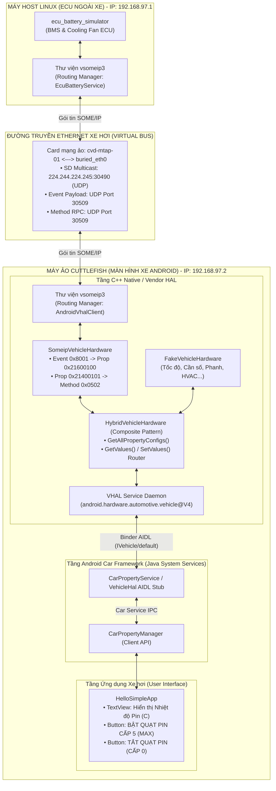
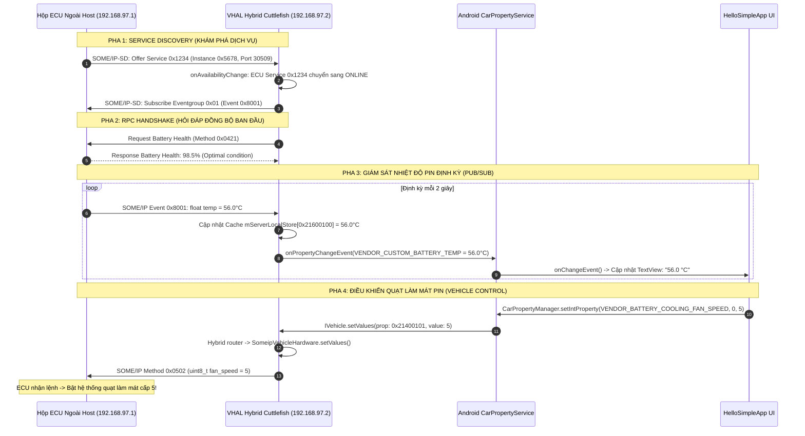

# TÀI LIỆU KỸ THUẬT: TÍCH HỢP AUTOMOTIVE VHAL AIDL VỚI GIAO THỨC SOME/IP (AUTOSAR) TRÊN ANDROID AUTOMOTIVE OS (AAOS)

---

## 1. TỔNG QUAN HỆ THỐNG (EXECUTIVE OVERVIEW)

Hệ thống được thiết kế và triển khai nhằm kết nối trực tiếp giữa **mạng truyền thông ô tô chuẩn AUTOSAR (SOME/IP qua Ethernet)** và **hệ điều hành Android Automotive (AAOS - Android 16)**. 

### Mục tiêu kỹ thuật đạt được:
1. **Kiến trúc 2 chiều hoàn chỉnh (End-to-End Bidirectional Pipeline)**:
   - **Chiều Giám sát (Monitoring - ECU $\rightarrow$ AAOS)**: Hộp điều khiển pin (BMS ECU) phát định kỳ bản tin SOME/IP nhiệt độ pin và sức khỏe pin qua mạng Ethernet xe hơi $\rightarrow$ VHAL tiếp nhận, chuyển đổi sang dữ liệu Android AIDL $\rightarrow$ CarPropertyService $\rightarrow$ Ứng dụng Android hiển thị lên màn hình xe.
   - **Chiều Điều khiển (Control - AAOS $\rightarrow$ ECU)**: Người lái bấm nút điều khiển quạt làm mát trên màn hình xe $\rightarrow$ CarPropertyManager $\rightarrow$ VHAL đóng gói thành gói tin SOME/IP RPC Method $\rightarrow$ Gửi ngược qua Ethernet tới ECU $\rightarrow$ ECU nhận lệnh và điều chỉnh tốc độ quạt theo thời gian thực.
2. **Kiến trúc Hybrid VHAL (Composite Hardware Pattern)**:
   - Không phá vỡ hệ thống Cuttlefish của Google: Kết hợp song song cả [`FakeVehicleHardware`](file:///home/kpit/aosp/android-16/hardware/interfaces/automotive/vehicle/aidl/impl/current/fake_impl/hardware/src/FakeVehicleHardware.cpp) (duy trì hàng trăm thuộc tính tiêu chuẩn như Tốc độ, Cần số, Phanh, HVAC) và [`SomeipVehicleHardware`](file:///home/kpit/aosp/android-16/hardware/interfaces/automotive/vehicle/aidl/impl/current/someip/SomeipVehicleHardware.cpp) (xử lý các tín hiệu xe điện thực tế).
3. **Mô hình kết nối chuẩn công nghiệp (Real-World Host-Guest Network Topology)**:
   - Máy **Host Linux (Ubuntu)** đóng vai trò là hộp **ECU vật lý ngoài xe**.
   - Máy ảo **Cuttlefish** đóng vai trò là **Màn hình giải trí xe (IVI / Head Unit)**.

---

## 2. SƠ ĐỒ KIẾN TRÚC TỔNG THỂ (SYSTEM ARCHITECTURE)



---

## 3. SƠ ĐỒ TUẦN TỰ TRUYỀN NHẬN TÍN HIỆU (SEQUENCE DIAGRAM)



---

## 4. CHI TIẾT CÁC THÀNH PHẦN MÃ NGUỒN ĐÃ PHÁT TRIỂN

### 4.1. Bảng thuộc tính xe tùy biến (Custom Vendor Properties)
Được định nghĩa trong [`TestVendorProperty.aidl`](file:///home/kpit/aosp/android-16/hardware/interfaces/automotive/vehicle/aidl/impl/current/utils/test_vendor_properties/android/hardware/automotive/vehicle/TestVendorProperty.aidl):

| Tên thuộc tính | Mã Hex | Mã Integer (Thập phân) | Kiểu dữ liệu | Quyền truy cập | Ý nghĩa |
| :--- | :--- | :--- | :--- | :--- | :--- |
| `VENDOR_CUSTOM_BATTERY_TEMP` | `0x21600100` | `559939840` | `FLOAT` | `READ` | Nhiệt độ pin cao áp xe điện (°C) |
| `VENDOR_BATTERY_COOLING_FAN_SPEED` | `0x21400101` | `557842689` | `INT32` | `READ_WRITE` | Cấp độ quạt làm mát pin (0 = Tắt, 1-5 = Tốc độ) |

---

### 4.2. File cấu hình SOME/IP mạng ô tô
1. **File cấu hình ECU ngoài Host**: [`vsomeip-ecu.json`](file:///home/kpit/aosp/android-16/hardware/interfaces/automotive/vehicle/aidl/impl/current/someip/vsomeip-ecu.json)
   - Unicast IP: `192.168.97.1`
   - Routing Manager: `EcuBatteryService`
   - Cung cấp: Service `0x1234`, Instance `0x5678`, Cổng UDP `30509`.
   - Eventgroup: `0x01` chứa sự kiện nhiệt độ `0x8001`.
2. **File cấu hình VHAL trong Cuttlefish**: [`vsomeip-vhal.json`](file:///home/kpit/aosp/android-16/hardware/interfaces/automotive/vehicle/aidl/impl/current/someip/vsomeip-vhal.json)
   - Unicast IP: `192.168.97.2` (card mạng `buried_eth0`).
   - Routing Manager: `AndroidVhalClient`
   - Service Provider: Khai báo Service `0x1234` nằm tại `192.168.97.1`.

---

### 4.3. Thành phần Hộp ECU Pin: `EcuBatterySimulator.cpp`
- **Vị trí**: [`EcuBatterySimulator.cpp`](file:///home/kpit/aosp/android-16/hardware/interfaces/automotive/vehicle/aidl/impl/current/someip/EcuBatterySimulator.cpp)
- **Chức năng**:
  - Khởi tạo node SOME/IP server trên host.
  - Vòng lặp timer (thread riêng): Bắn nhiệt độ pin tăng/giảm từ 35°C đến 60°C định kỳ mỗi 2 giây qua `offer_event(0x8001)`.
  - Đăng ký bộ lắng nghe `register_message_handler(0x0421)`: Xử lý yêu cầu kiểm tra Battery Health, trả về `98.5%`.
  - Đăng ký bộ lắng nghe `register_message_handler(0x0502)`: Xử lý lệnh điều khiển quạt pin từ Android gửi xuống (`fan_speed` từ 0 đến 5).

---

### 4.4. Thành phần Phần cứng VHAL: `SomeipVehicleHardware.{h,cpp}`
- **Vị trí**: [`SomeipVehicleHardware.h`](file:///home/kpit/aosp/android-16/hardware/interfaces/automotive/vehicle/aidl/impl/current/someip/SomeipVehicleHardware.h) & [`SomeipVehicleHardware.cpp`](file:///home/kpit/aosp/android-16/hardware/interfaces/automotive/vehicle/aidl/impl/current/someip/SomeipVehicleHardware.cpp)
- **Chức năng**:
  - `initSomeip()`: Kết nối vào runtime `vsomeip`, đăng ký lắng nghe Service `0x1234` và Event `0x8001`.
  - `onSomeipMessage()`: Khi nhận được byte array từ mạng, giải mã ra `float batteryTemp`, đóng gói vào struct `aidlvhal::VehiclePropValue`, lưu vào cache bộ nhớ đệm `mServerLocalStore` (bảo vệ bằng mutex đa luồng `mValueLock`), và gọi callback `mPropChangeCallback` để đẩy lên CarService.
  - `getValues()`: Cho phép CarService truy vấn giá trị nhiệt độ hoặc quạt tức thì từ cache RAM.
  - `setValues()`: Khi CarService ghi thuộc tính `0x21400101`, hàm này đóng gói `int32_t` thành payload SOME/IP và gọi `mApp->send(request)` với Method `0x0502` để truyền qua mạng xuống ECU.

---

### 4.5. Kiến trúc Hybrid VHAL: `VehicleService.cpp`
- **Vị trí**: [`VehicleService.cpp`](file:///home/kpit/aosp/android-16/hardware/interfaces/automotive/vehicle/aidl/impl/current/vhal/src/VehicleService.cpp)
- **Mô hình**: Composite Pattern kế thừa `IVehicleHardware`.
- **Cơ chế hoạt động**:
  - Chứa 2 con trỏ: `std::unique_ptr<FakeVehicleHardware> mFakeHardware` và `std::unique_ptr<SomeipVehicleHardware> mSomeipHardware`.
  - `getAllPropertyConfigs()`: Gộp cấu hình của cả Google Fake và SOME/IP.
  - `getValues()` và `setValues()`: Kiểm tra `propId`. Nếu là `0x21600100` hoặc `0x21400101` $\rightarrow$ Chuyển tiếp tới `SomeipVehicleHardware`. Tất cả thuộc tính còn lại $\rightarrow$ Chuyển tiếp tới `FakeVehicleHardware`.

---

### 4.6. Giao diện Ứng dụng: `HelloSimpleApp`
- **Vị trí**: [`MainActivity.java`](file:///home/kpit/aosp/android-16/packages/apps/HelloSimpleApp/src/com/example/hellosimple/MainActivity.java) & [`activity_main.xml`](file:///home/kpit/aosp/android-16/packages/apps/HelloSimpleApp/res/layout/activity_main.xml)
- **Chức năng**:
  - Đăng ký `CarPropertyManager.CarPropertyEventCallback` lắng nghe sự kiện thay đổi thuộc tính `0x21600100`.
  - Bổ sung 2 nút bấm điều khiển quạt pin:
    - Nút **"BẬT QUẠT PIN CẤP 5 (MAX)"**: Gọi `mCarPropertyManager.setIntProperty(557842689, 0, 5)`.
    - Nút **"TẮT QUẠT PIN"**: Gọi `mCarPropertyManager.setIntProperty(557842689, 0, 0)`.

---

## 5. NHẬT KÝ GỠ LỖI TOÀN DIỆN (CHALLENGES & ROOT CAUSE ANALYSIS)

Trong quá trình xây dựng từ tầng thấp (C++ / Kernel / VINTF) lên tầng cao (Android Framework / UI), hệ thống đã vượt qua các thử thách kỹ thuật quan trọng sau:

| STT | Hiện tượng lỗi | Nguyên nhân cốt lõi | Cách xử lý triệt để |
| :---: | :--- | :--- | :--- |
| **1** | `Invalid lunch combo: aosp_cf_x86_64_auto-userdebug` | AOSP Android 16 áp dụng Trunk Stable Release Workflow, yêu cầu định danh cấu hình phát hành (`TARGET_RELEASE`). | Chuyển sang lunch combo chuẩn: `lunch aosp_cf_x86_64_auto-bp2a-userdebug`. |
| **2** | `can't open boot.img: No such file or directory` | Các lệnh `m <module>` chỉ compile binary đơn lẻ mà không đóng gói các image phân vùng đĩa. Lệnh `installclean` trước đó đã dọn sạch `.img`. | Sửa lỗi cú pháp trong [`AidlVehicleStub.java`](file:///home/kpit/aosp/android-16/packages/services/Car/service/src/com/android/car/AidlVehicleStub.java) và chạy lệnh `m` để đóng gói đầy đủ `super.img`, `boot.img`, `userdata.img`. |
| **3** | `VINTF conflict: IVehicle/default (@4) vs (@3)` | Khi build riêng lẻ VHAL V4, file manifest `vhal-default-service.xml` tồn đọng trong `vendor/etc/vintf/manifest/`, xung đột với APEX V3 mặc định của Cuttlefish. | Xóa bỏ file manifest dư thừa, dọn đường cho VINTF kiểm tra tương thích. |
| **4** | `ISimple/default (@1) not specified in framework compatibility matrix` | Custom HAL `android.hardware.simple` có trong Device Manifest (`vendor`) nhưng thiếu khai báo trong Framework Compatibility Matrix (`system`). | Tạo [`framework_compatibility_matrix.xml`](file:///home/kpit/aosp/android-16/device/google/cuttlefish/shared/framework_compatibility_matrix.xml) và liên kết vào [`shared/device.mk`](file:///home/kpit/aosp/android-16/device/google/cuttlefish/shared/device.mk). Lệnh `m check-vintf-all` đã báo `COMPATIBLE`! |
| **5** | `CANNOT LINK: library "libvsomeip3.so" & "libboost_system.so" not found` | Dynamic linker trong Cuttlefish không tìm thấy các thư viện liên kết động đi kèm của `vsomeip`. | Đẩy toàn bộ `libvsomeip3*.so` và `libboost_*.so` từ `out/.../vendor/lib64/` vào `/vendor/lib64/` của Cuttlefish. |
| **6** | `FakeVehicleHardware: Failed to open config directory: .../vhalconfig/` | `FakeVehicleHardware` cần nạp các thuộc tính gốc từ file `DefaultProperties.json` trong thư mục `vhalconfig`. | Đẩy thư mục [`vhalconfig/`](file:///home/kpit/aosp/android-16/out/target/product/vsoc_x86_64_only/vendor/etc/automotive/vhalconfig/) vào `/vendor/etc/automotive/`. |
| **7** | `netlink_connector received error message: Unknown error -16` | User thường trên Linux không có quyền tạo route multicast (`224.244.224.245`), khiến gói tin SOME/IP bị đẩy nhầm sang card WiFi thay vì chui vào máy ảo. | Thêm tuyến đường mạng vào kernel: `sudo ip route add 224.244.224.245/32 dev cvd-mtap-01`. |
| **8** | `local_client_endpoint: Couldn't connect to: /tmp/vsomeip-0` | Dùng lệnh `sudo` làm mất biến môi trường `VSOMEIP_CONFIGURATION`, khiến ECU tưởng mình là client và đi tìm daemon IPC. | Chạy ECU bằng user thông thường với biến môi trường đầy đủ (không cần `sudo` vì route đã nạp sẵn vào kernel). |

---

## 6. HƯỚNG DẪN VẬN HÀNH CHUẨN (OPERATIONAL RUNBOOK)

Khi cần trình diễn hoặc kiểm thử lại từ đầu, thực hiện đúng các bước sau:

### Bước 1: Khởi động Cuttlefish
```bash
stop_cvd 2>/dev/null
launch_cvd --config=auto --daemon
```
*Truy cập màn hình xe hơi tại: [https://localhost:8443](https://localhost:8443).*

### Bước 2: Tắt VHAL cũ và khởi động VHAL Hybrid (Terminal 1)
```bash
adb shell stop vendor.vehicle-cf-eth
adb shell stop vendor.vehicle-cf-vsock
adb shell "export VSOMEIP_CONFIGURATION=/vendor/etc/vsomeip/vsomeip-vhal.json && /vendor/bin/hw/android.hardware.automotive.vehicle@V4-default-service"
```

### Bước 3: Khởi động ECU Simulator ngoài máy Host (Terminal 2)
```bash
cd /home/kpit/aosp/android-16
export VSOMEIP_CONFIGURATION=hardware/interfaces/automotive/vehicle/aidl/impl/current/someip/vsomeip-ecu.json
./out/host/linux-x86/bin/ecu_battery_simulator
```

### Bước 4: Nghiệm thu kết quả
1. **Kiểm tra Logcat nhận tin liên tục**:
   ```bash
   adb logcat -s SomeipVehicleHardware
   ```
2. **Kiểm tra CarService Property**:
   ```bash
   adb shell cmd car_service list-vhal-props | grep 559939840
   ```
3. **Thao tác trên màn hình App**: Bấm nút **"BẬT QUẠT PIN CẤP 5 (MAX)"** $\rightarrow$ Terminal ECU ngoài máy host in log nhận lệnh điều khiển quạt lập tức!
